# MoonLamp7697
moon lamp & voronoi lamp for linkit7697

本專案製作一個造型檯燈可透過

## 材料 material 

* Linkit7697
* WS2812 4LED board 燈板
* 3DP housing 3D 列印外殼
* Micro USB cable

## 組裝說明 installation guide

### Moon Lamp

  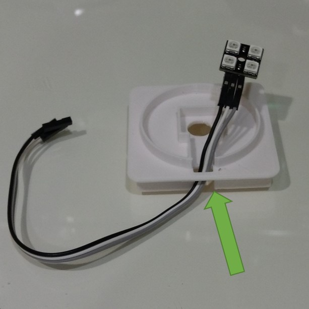
  
  取燈座蓋，將LED引線穿過開孔
  
  
  
  連接Linkit7697 
  | Linkit7697 | LED Board |
  |------------|-----------|
  | P5         | DIN       |
  | VCC        | VCC       |
  | GND        | GND       |
  
  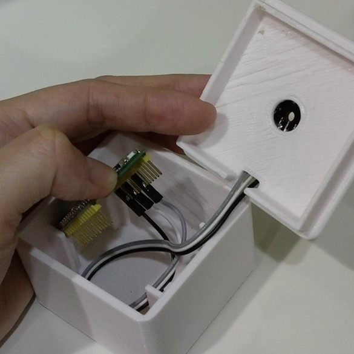
  
  將 Linkit7697 放入底座中，先對準並扣入USB側開孔
  
  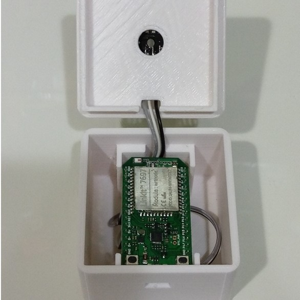
  
  固定 Linkit7697 並將杜邦線從後方預留的線槽中穿出
  
  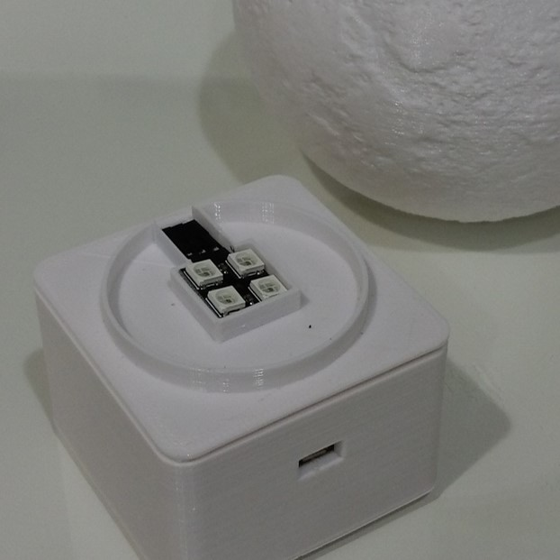
  
  將 LED 燈板扣入中間凹槽處固定
  
  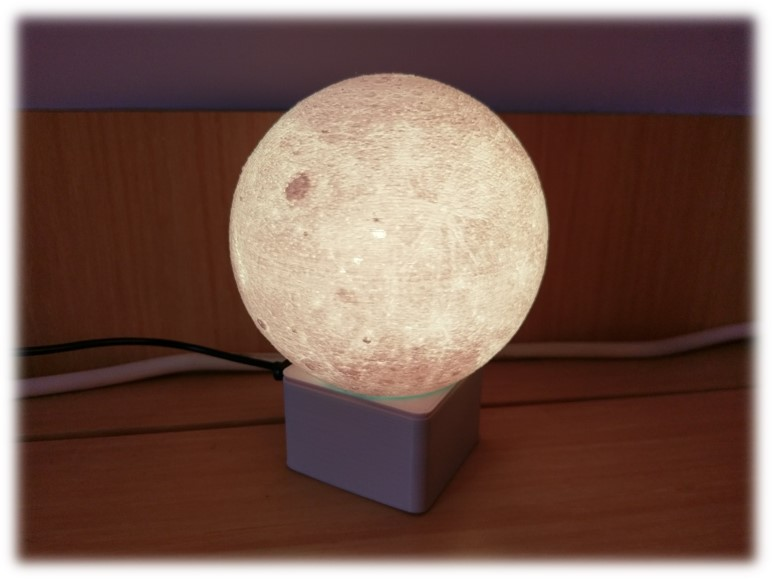
  
  蓋上燈罩，完成

### Voronoi Lamp

  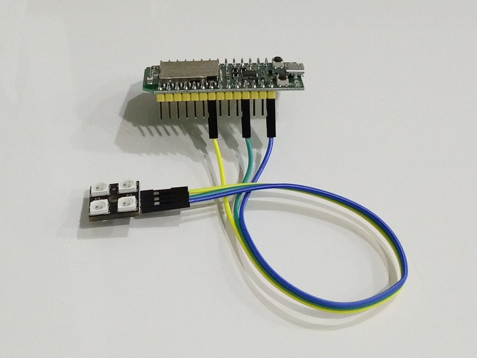
  
  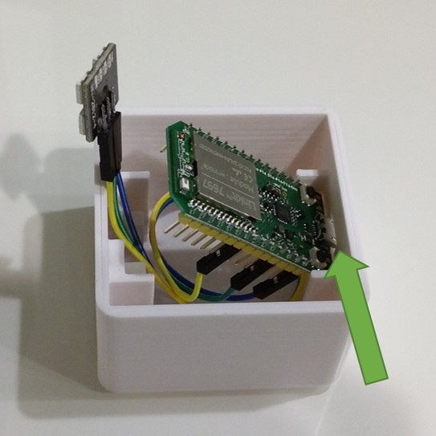
  
  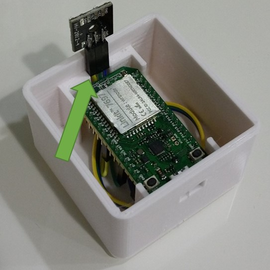
  
  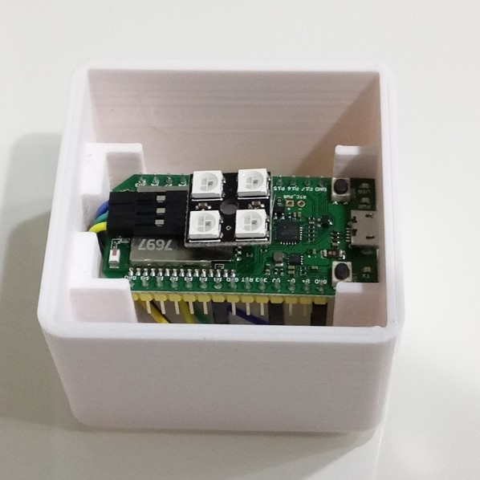
  
  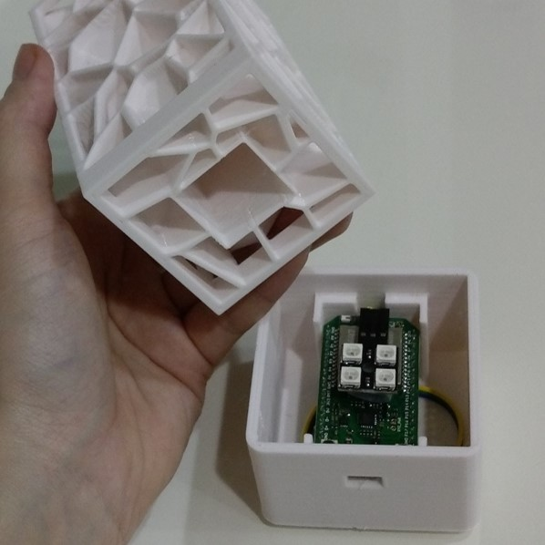
  
  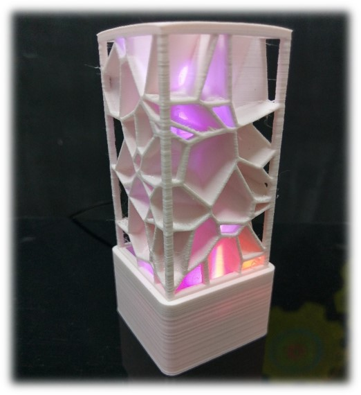
  
  

